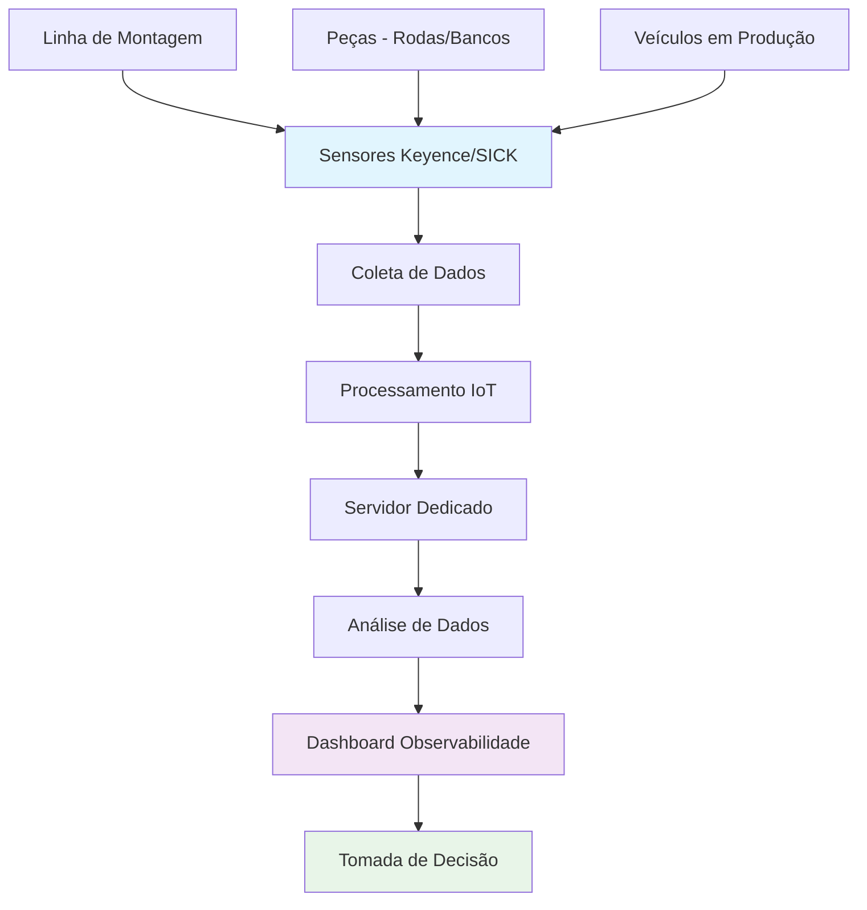
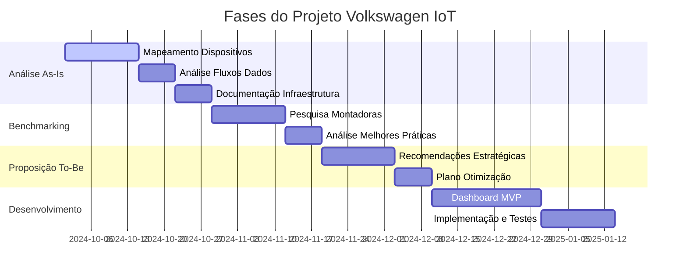

# 🚗 Sistema de Controle de Consumo de Peças - Volkswagen do Brasil

## 📋 Visão Geral do Projeto

### 🎯 Objetivo Principal
Desenvolver e implementar um **painel de observabilidade** para a arquitetura IoT existente no processo produtivo da Volkswagen, visando a identificação proativa de gargalos operacionais e oportunidades de otimização.

### 🏢 Sobre a Volkswagen do Brasil
A Volkswagen Brasil é uma das filiais do Grupo Volkswagen. Fundada em 1953, é onde a montadora alemã tem maior presença fora de sua sede. Presente na vida dos brasileiros há **70 anos**, a Volkswagen é:
- **Maior produtora** de automóveis do Brasil (24 milhões de veículos)
- **Maior exportadora** da história (4+ milhões de carros embarcados)

---

## 🚨 Problema Identificado

### Situação Atual
A arquitetura IoT atualmente implementada no processo produtivo da Volkswagen carece de um **sistema de observabilidade unificado e proativo**, resultando em:

| **Impacto** | **Descrição** |
|-------------|---------------|
| **Ineficiências Operacionais** | Dificuldade na identificação rápida de gargalos |
| **Decisões Reativas** | Limitação na capacidade de otimização |
| **Tempo de Montagem** | Impacto negativo no tempo de montagem dos veículos |
| **Qualidade** | Índice subótimo de peças rejeitadas |

### Benefícios Esperados
- ✅ **Maximizar eficiência** de fluxo de peças
- ✅ **Reduzir estoque** ao mínimo necessário
- ✅ **Otimizar tempo** de montagem
- ✅ **Reduzir índice** de peças rejeitadas

---

## 🎯 Objetivos do Projeto

### Objetivo Principal
Desenvolver um **pipeline de dados em tempo real** integrado a tecnologias da **Indústria 4.0** para garantir:
- **Governança** eficiente de informações do processo produtivo
- **Painel de observabilidade** para volume de estoque e consumo de peças
- **Previsão de consumo** baseada no histórico de veículos produzidos
- **Auditoria contínua** para identificação de gargalos

### Foco Específico
- **Processo de montagem** das **rodas e bancos**
- **Análise "As-Is"** da arquitetura IoT existente
- **Benchmarking** com montadoras líderes (BMW, Mercedes, Audi, BYD)
- **Proposição de otimizações** baseadas em melhores práticas

---

## 👥 Equipe do Projeto

| **Função** | **Nome** | **Responsabilidade** |
|------------|----------|----------------------|
| **Professor Orientador** | Marcelo Luiz do Amaral Gonçalves | Orientação acadêmica |
| **Líder do Projeto** | Everton Tessari | Coordenação geral |
| **Ponto Focal Backup** | Antonio Fabiano Pires | Suporte técnico |
| **Ponto Focal Backup** | Thiago Alves | Suporte técnico |
| **Líder Executivo** | Tito Jorge Sonagere | Supervisão executiva |

### Áreas Envolvidas
- **Qualidade Assegurada** (Área principal)
- **Operação e Logística** (Stakeholders)

---

## 📊 Escopo e Dados

### Dados Disponíveis
| **Campo** | **Descrição** | **Período** |
|-----------|---------------|-------------|
| **ID** | Identificador único do veículo | Últimos 2 meses |
| **Modelo** | Modelo do veículo produzido | Últimos 2 meses |
| **Data de Entrada** | Data de entrada na linha | Últimos 2 meses |
| **Local de Montagem** | Local específico de montagem | Últimos 2 meses |
| **Código de Configurações** | Configurações do veículo | Últimos 2 meses |

### Formato dos Dados
- **Arquivo:** `.csv`
- **Período:** Últimos 2 meses
- **Uso:** Base inicial para construção do MVP

---

## 🏗️ Arquitetura e Infraestrutura

### Fluxo de Dados IoT - Volkswagen

### Tecnologias Atuais
| **Categoria** | **Tecnologia** | **Função** |
|---------------|----------------|------------|
| **Hardware** | Leitores Keyence e SICK | Leitura de códigos |
| **Software** | Sistema IoT proprietário | Processamento IoT |
| **Infraestrutura** | Servidor dedicado | Aplicações IoT |
| **Suporte** | 10+ pessoas | 4 plantas do Brasil |

---

## 🚀 Fases do Projeto (MVP)

### Roadmap do Projeto

### Fase 1: Análise "As-Is"
| **Atividade** | **Descrição** | **Entregável** |
|---------------|---------------|----------------|
| **Mapeamento** | Dispositivos IoT existentes | Documentação completa |
| **Análise de Fluxos** | Dados de peças e produção | Identificação de lacunas |
| **Documentação** | Infraestrutura atual | Mapeamento técnico |

### Fase 2: Benchmarking
| **Atividade** | **Descrição** | **Foco** |
|---------------|---------------|----------|
| **Pesquisa** | Casos de sucesso na indústria | BMW, Mercedes, Audi, BYD |
| **Análise** | Abordagens e tecnologias | Gestão de linhas de montagem |
| **Identificação** | Melhores práticas | Frameworks inovadores |

### Fase 3: Proposição "To-Be"
| **Atividade** | **Descrição** | **Resultado** |
|---------------|---------------|---------------|
| **Recomendações** | Estratégicas e táticas | Plano de otimização |
| **Plano To-Be** | Melhorias propostas | Arquitetura otimizada |
| **Impacto** | Tempo de montagem e qualidade | Métricas de melhoria |

### Fase 4: Desenvolvimento do Painel
| **Funcionalidade** | **Descrição** | **Benefício** |
|-------------------|---------------|---------------|
| **Dashboard Interativo** | Painel centralizado | Visão unificada |
| **KPIs** | Métricas de desempenho | Monitoramento contínuo |
| **Tempo Real** | Visualização dinâmica | Decisões ágeis |
| **Drill-down** | Investigação de anomalias | Análise detalhada |
| **Alertas** | Gargalos potenciais | Ação proativa |

---

## 📈 Entregáveis Esperados

### Dashboard Principal
- **Interface intuitiva** para tomada de decisão
- **Métricas em tempo real** do processo produtivo
- **Visualização de dados** históricos e atuais
- **Funcionalidades de alerta** para gargalos

### Documentação Técnica
- **Análise As-Is** da arquitetura atual
- **Benchmarking** da indústria automotiva
- **Propostas de otimização** (To-Be)
- **Manual de implementação**

### Stakeholders
- **Áreas de Operação** e **Logística** da Volkswagen
- **Tomada de decisão estratégica** baseada em dados

---

## ⚠️ Restrições e Limitações

### Escopo Limitado
| **Restrição** | **Descrição** |
|---------------|---------------|
| **Peças** | Apenas rodas e bancos |
| **Dados** | Últimos 2 meses (.csv) |
| **Hardware** | Compatibilidade com Keyence/SICK |
| **Ambiente** | Testes controlados/simulação |
| **Equipe** | Recursos limitados de desenvolvimento |

### O Projeto NÃO Contempla
- ❌ Integração com SAP, MES ou ERP
- ❌ Automação física de reabastecimento
- ❌ Desenvolvimento de hardware IoT
- ❌ Modelos avançados de IA/ML em produção
- ❌ Gestão de fornecedores/compras
- ❌ Implantação em múltiplas plantas

---

## 🔒 Informações Confidenciais

### Conteúdo Restrito
- **Informações técnicas** não podem ser divulgadas
- **Dados da empresa** são confidenciais
- **Arquitetura interna** é proprietária

---

## 🛠️ Tecnologias e Conceitos

### Indústria 4.0
- **Tecnologias digitais** integradas
- **Automação inteligente** de processos
- **Análise de dados** em tempo real
- **Otimização contínua** de operações

---

## 📞 Contato e Suporte

### Equipe de Desenvolvimento
- **Professor Orientador:** Marcelo Luiz do Amaral Gonçalves
- **Líder do Projeto:** Everton Tessari
- **Suporte Técnico:** Antonio Fabiano Pires, Thiago Alves

### Áreas Envolvidas
- **Qualidade Assegurada** (Área principal)
- **Operação e Logística** (Stakeholders)

---

## 📚 Recursos Adicionais

### Documentação Técnica
- Arquitetura IoT da Volkswagen
- Melhores práticas da indústria automotiva
- Tecnologias de processamento de dados

### Conceitos Relacionados
- **IoT Industrial**
- **Indústria 4.0**
- **Processamento de Dados em Tempo Real**
- **Observabilidade de Sistemas**
- **Otimização de Processos Produtivos**

---

## 🎯 Próximos Passos

1. **Análise detalhada** da arquitetura atual
2. **Benchmarking** com montadoras líderes
3. **Desenvolvimento** do painel de observabilidade
4. **Implementação** e validação do MVP
5. **Proposição** de melhorias arquiteturais

---

**Este projeto representa uma oportunidade única de aplicar tecnologias IoT avançadas para otimizar processos produtivos de uma das maiores montadoras do Brasil.** 🚗✨

---

*Desenvolvido para a Volkswagen do Brasil - Projeto 1AMD4 IoT*
