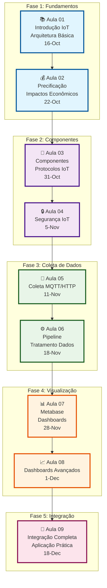
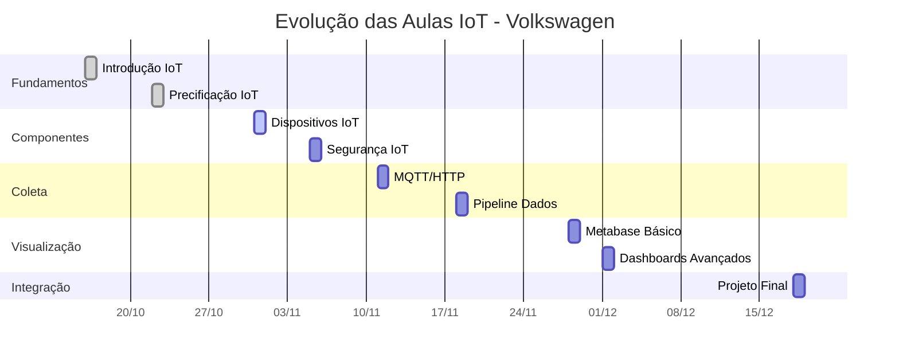

# 📈 Evolução das Aulas - Módulo IoT Volkswagen

## 🎯 Jornada de Aprendizado IoT

## 🎯 Progressão por Competências

```mermaid
graph LR
    subgraph "Conhecimento Teórico"
        T1[Conceitos IoT]
        T2[Arquitetura]
        T3[Segurança]
        T4[Protocolos]
    end
    
    subgraph "Habilidades Técnicas"
        H1[Coleta Dados]
        H2[Processamento]
        H3[Visualização]
        H4[Integração]
    end
    
    subgraph "Aplicação Prática"
        P1[Projeto MVP]
        P2[Dashboard]
        P3[Otimização]
        P4[Implementação]
    end
    
    T1 --> T2 --> T3 --> T4
    T4 --> H1
    H1 --> H2 --> H3 --> H4
    H4 --> P1
    P1 --> P2 --> P3 --> P4
    
    classDef teorico fill:#e3f2fd,stroke:#1976d2,stroke-width:2px
    classDef tecnico fill:#f1f8e9,stroke:#388e3c,stroke-width:2px
    classDef pratico fill:#fff8e1,stroke:#f57c00,stroke-width:2px
    
    class T1,T2,T3,T4 teorico
    class H1,H2,H3,H4 tecnico
    class P1,P2,P3,P4 pratico
```

## 📊 Timeline de Desenvolvimento

## 🎯 Objetivos por Fase

### Fase 1: Fundamentos (Aulas 1-2)
- ✅ Compreender conceitos básicos de IoT
- ✅ Entender arquitetura e precificação
- ✅ Base teórica sólida

### Fase 2: Componentes (Aulas 3-4)
- ✅ Conhecer dispositivos e protocolos
- ✅ Entender aspectos de segurança
- ✅ Fundamentos técnicos

### Fase 3: Coleta (Aulas 5-6)
- ✅ Implementar coleta de dados
- ✅ Desenvolver pipelines
- ✅ Processamento de dados

### Fase 4: Visualização (Aulas 7-8)
- ✅ Criar dashboards básicos
- ✅ Desenvolver visualizações avançadas
- ✅ Interface de usuário

### Fase 5: Integração (Aula 9)
- ✅ Integrar todos os componentes
- ✅ Aplicação prática completa
- ✅ Projeto final funcional

## 🚀 Resultado Final

Ao final do módulo, os alunos terão desenvolvido:

1. **Sistema IoT Completo** para Volkswagen
2. **Dashboard de Observabilidade** em tempo real
3. **Pipeline de Dados** otimizado
4. **Solução Prática** para identificação de gargalos
5. **Conhecimento Aplicado** em Indústria 4.0

---

*Evolução progressiva do conhecimento IoT aplicado ao projeto Volkswagen* 🚗✨
